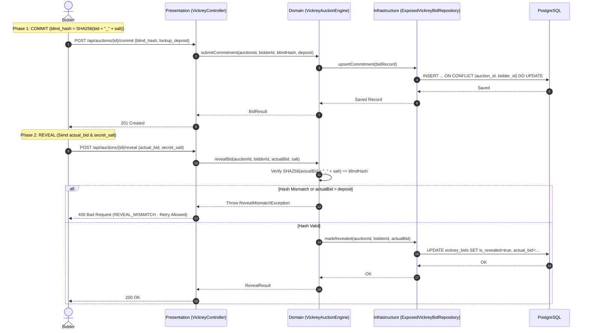
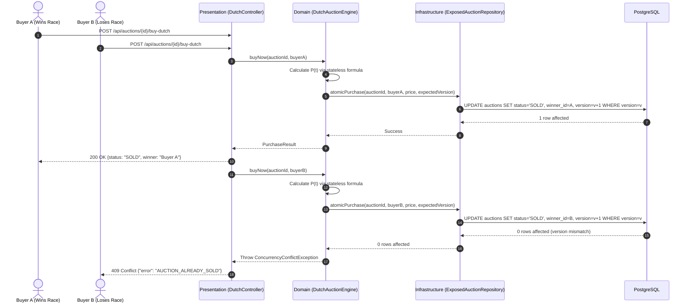

# System Architecture & Technical Design

Kronyka is designed as a decoupled, layered backend service following **Clean Architecture** (Hexagonal / Ports & Adapters) principles. This ensures business domain independence from the web framework, persistence layer, and external libraries.

---

## 1. Architectural Layers & Separation of Concerns

```
example.kronyka/
│
├── domain/                                  # 1. DOMAIN LAYER (Pure Business Core)
│   ├── model/                               # Entities, value objects, enums, exceptions
│   ├── repository/                          # Repository ports (pure Kotlin interfaces)
│   └── service/                             # Domain engines & use case workflows
│
├── presentation/                            # 2. PRESENTATION LAYER (Inbound Web Adapter)
│   ├── controller/                          # Spring REST Controllers (JSON API)
│   ├── dto/                                 # Request/Response DTOs & Validation
│   └── advice/                              # Global exception handlers & RFC error models
│
└── infrastructure/                          # 3. INFRASTRUCTURE LAYER (Outbound Adapters)
    ├── persistence/                         # Exposed SQL DSL tables & repository adapters
    ├── security/                            # Centralized JWT authentication filter & config
    └── config/                              # Spring Boot & Exposed database configuration
```

### Layer Dependency Rule
Dependencies flow **strictly inward**:
`Presentation -> Domain <- Infrastructure`

- **Domain Layer**:
  - Independent of Spring Web, Exposed SQL, JDBC, or any framework annotations.
  - Fully unit-testable without database or web container mocks.
- **Presentation Layer**:
  - Exposes REST endpoints conforming to HTTP/JSON standards.
  - Applies input validation (`@Valid`, Jakarta constraints) and maps domain exceptions to standard HTTP status codes.
- **Infrastructure Layer**:
  - Implements the repository ports defined in `domain/repository/` using JetBrains Exposed SQL DSL queries.
  - Manages database transactions, connections, and security middleware.

---

## 2. Interaction & Sequence Flows

### 2.1. Vickrey Sealed-Bid Engine (3-Phase Commit-Reveal)



### 2.2. Step-Decay Dutch Auction (Concurrency Control)



---

## 3. Concurrency & Integrity Mechanisms

1. **Optimistic Locking (`version`)**:
   - The Dutch engine leverages optimistic concurrency control directly in SQL to serialize competing "Buy Now" requests without locking read queries.
2. **Atomic Upserts for Vickrey Commitments**:
   - A unique constraint on `(auction_id, bidder_id)` allows bidders to update their deposit commitments safely without race conditions.
3. **Stateless Step Math**:
   - Price calculation is completely functional and stateless in memory, removing background timer updates and database write amplification.
