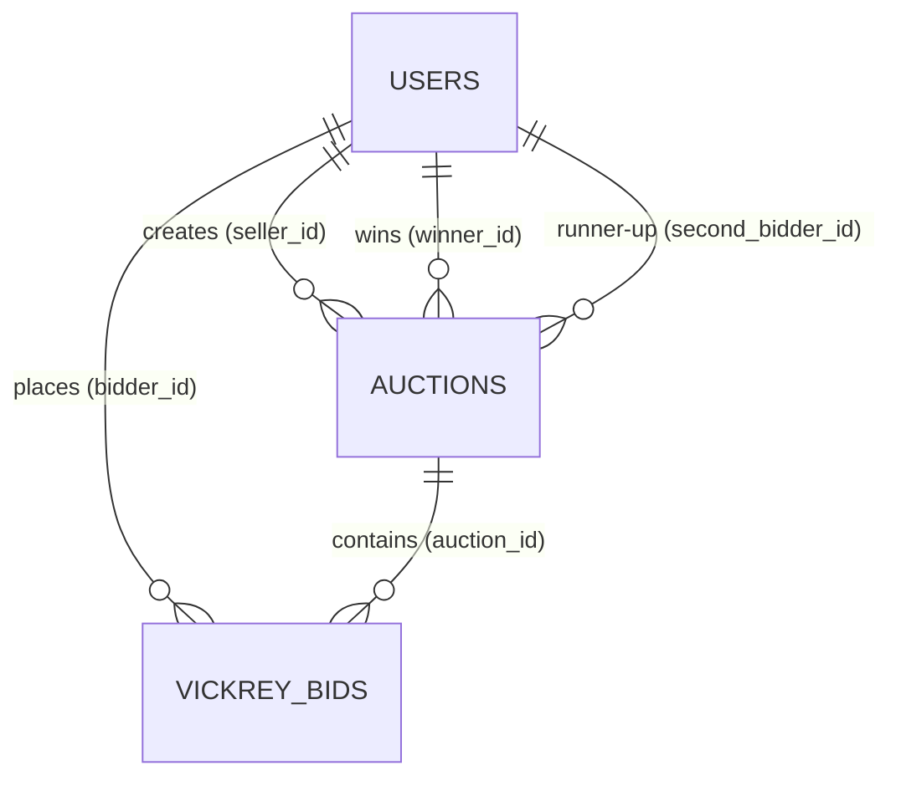

# Database Schema & Data Dictionary

Kronyka uses **PostgreSQL 18** (Docker image `postgres:18-alpine`). All monetary fields store Vietnamese Dong (VNĐ) as `BIGINT` to prevent floating-point inaccuracies.

---

## 1. Entity-Relationship Diagram

---

## 2. Table Specifications

### 2.1. `users`
| Column | Type | Nullable | Default | Description |
| :--- | :--- | :--- | :--- | :--- |
| `id` | `UUID` | No | `gen_random_uuid()` | Primary Key |
| `username` | `VARCHAR(50)` | No | | Unique username |
| `password_hash`| `VARCHAR(100)` | No | | BCrypt hash |
| `full_name` | `VARCHAR(100)` | No | | User display name |
| `created_at` | `TIMESTAMP` | No | `CURRENT_TIMESTAMP` | Registration timestamp |

### 2.2. `auctions`
| Column | Type | Nullable | Default | Description |
| :--- | :--- | :--- | :--- | :--- |
| `id` | `UUID` | No | `gen_random_uuid()` | Primary Key |
| `seller_id` | `UUID` | No | | Foreign Key -> `users(id)` |
| `title` | `VARCHAR(255)` | No | | Auction title |
| `type` | `VARCHAR(20)` | No | | `VICKREY` or `DUTCH` |
| `status` | `VARCHAR(20)` | No | | `COMMIT`, `REVEAL`, `ACTIVE`, `SOLD`, `SETTLED`, `CANCELLED` |
| `start_price` | `BIGINT` | Yes | | Starting price (Dutch) in VNĐ |
| `floor_price` | `BIGINT` | Yes | | Floor reserve price (Dutch) in VNĐ |
| `step_decrement`| `BIGINT` | Yes | | Price decrement per interval (Dutch) |
| `step_interval_seconds` | `INT` | Yes | | Interval duration in seconds (Dutch) |
| `reserve_price`| `BIGINT` | Yes | | Reserve price (Vickrey) in VNĐ |
| `start_time` | `TIMESTAMP` | No | | Auction start timestamp |
| `commit_end_time` | `TIMESTAMP`| Yes | | Commit phase deadline (Vickrey) |
| `reveal_end_time` | `TIMESTAMP`| Yes | | Reveal phase deadline (Vickrey) |
| `end_time` | `TIMESTAMP` | No | | Overall auction end timestamp |
| `winner_id` | `UUID` | Yes | | Foreign Key -> `users(id)` (Winner) |
| `second_bidder_id` | `UUID` | Yes | | Foreign Key -> `users(id)` (Vickrey runner-up) |
| `final_price` | `BIGINT` | Yes | | Final settled transaction price in VNĐ |
| `version` | `BIGINT` | No | `0` | Optimistic lock counter (Dutch Buy Now) |
| `created_at` | `TIMESTAMP` | No | `CURRENT_TIMESTAMP` | Record creation timestamp |

### 2.3. `vickrey_bids`
| Column | Type | Nullable | Default | Description |
| :--- | :--- | :--- | :--- | :--- |
| `id` | `UUID` | No | `gen_random_uuid()` | Primary Key |
| `auction_id` | `UUID` | No | | Foreign Key -> `auctions(id)` (ON DELETE CASCADE) |
| `bidder_id` | `UUID` | No | | Foreign Key -> `users(id)` |
| `blind_hash` | `VARCHAR(64)` | No | | SHA-256 hash |
| `lockup_deposit`| `BIGINT` | No | | Visible deposit amount in VNĐ |
| `actual_bid` | `BIGINT` | Yes | | Revealed bid in VNĐ |
| `is_revealed` | `BOOLEAN` | No | `FALSE` | Reveal status |
| `created_at` | `TIMESTAMP` | No | `CURRENT_TIMESTAMP` | Commitment timestamp |
| `revealed_at` | `TIMESTAMP` | Yes | | Reveal timestamp |

---

## 3. Database Constraints & Indexes

1. **Unique Constraint**: `UNIQUE(auction_id, bidder_id)` on `vickrey_bids` to enforce single bid per user per auction and allow atomic upserts.
2. **Optimistic Locking**: `version` counter on `auctions` table checked and incremented upon state changes.
3. **Indexes**:
   - `idx_auctions_type_status` on `auctions(type, status)` for fast search and filtering.
   - `idx_vickrey_bids_settle` on `vickrey_bids(auction_id, is_revealed, actual_bid DESC)` for quick second-price winner calculation.
