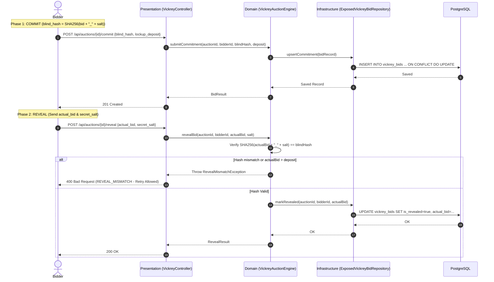
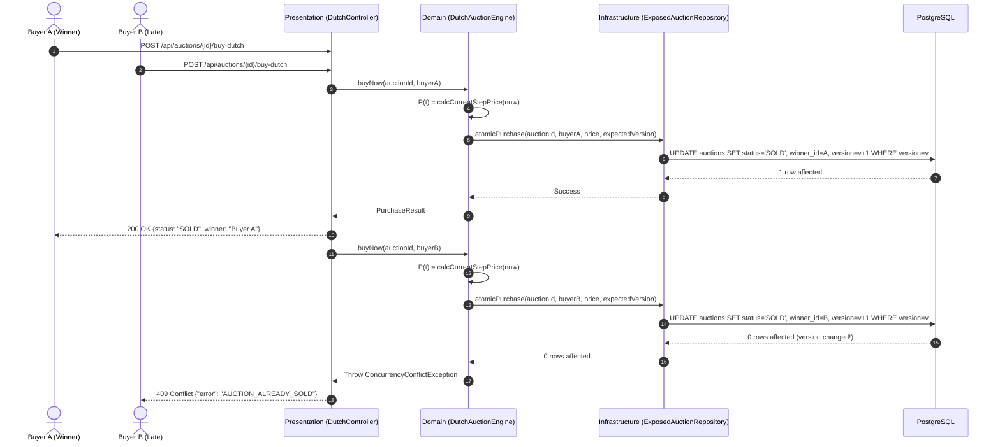

# System Architecture & Technical Design (LLM Context)

## 1. Architectural Blueprint: Clean / Hexagonal Architecture

Kronyka strictly follows Clean Architecture principles with three decoupled layers:

```text
src/main/kotlin/example/kronyka/
│
├── domain/                                  # 1. CORE BUSINESS DOMAIN (Zero framework/DB dependencies)
│   ├── model/                               # Pure entities, value objects, enums, domain exceptions
│   ├── repository/                          # Domain repository ports (pure Kotlin interfaces)
│   └── service/                             # Domain services, use case orchestration, auction engines
│
├── presentation/                            # 2. HTTP PRESENTATION LAYER (Inbound Web Adapter)
│   ├── controller/                          # Spring WebMVC REST controllers (OpenAPI annotated)
│   ├── dto/                                 # Request/Response DTOs and Jakarta Validation constraints
│   └── advice/                              # GlobalExceptionHandler mapping exceptions to standard RFC JSON
│
└── infrastructure/                          # 3. INFRASTRUCTURE LAYER (Outbound Adapters)
    ├── persistence/                         # Exposed SQL DSL tables & repository port implementations
    ├── security/                            # JWT token provider, OncePerRequestFilter, SecurityFilterChain
    └── config/                              # Spring configurations and Exposed database wiring
```

### Layer Constraints & Rules
- **Domain Layer (`domain/`)**: Pure Kotlin. **Zero imports** of Spring (`@Service`, `@Autowired`, Web classes), Exposed SQL, or JDBC. Repository interfaces (ports) are declared here.
- **Presentation Layer (`presentation/`)**: Inbound adapters. Validates incoming requests (`@Valid`), delegates to domain services, maps domain models to response DTOs.
- **Infrastructure Layer (`infrastructure/`)**: Outbound adapters. Implements domain repository interfaces using JetBrains Exposed SQL DSL directly against PostgreSQL. Configures Spring beans and JWT security filters.
- **Dependency Flow**: `presentation -> domain <- infrastructure`. Inward dependency direction only.

---

## 2. Sequence Diagrams

### 2.1. Vickrey Commit & Reveal Protocol



### 2.2. Step-Decay Dutch Auction Concurrency



---

## 3. Concurrency & Data Consistency Strategy

1. **Optimistic Versioning on Auctions Table**:
   - The `version` column is incremented atomically during state transitions (e.g., `ACTIVE -> SOLD`).
   - Prevents double-spending and multiple buyers simultaneously winning a Dutch auction.
2. **PostgreSQL Unique Constraint & Upsert on Vickrey Bids**:
   - `UNIQUE(auction_id, bidder_id)` ensures a single row per bidder per auction.
   - Upsert pattern allows users to safely modify their blind commitment before the commit window closes without race conditions or duplications.
3. **Stateless Tick-Based Math**:
   - Price calculation does not poll the database or run background updates.
   - Eliminates database write amplification during Dutch auctions.

---

## 4. Multi-Layer Testing Architecture

| Layer | Runner / Framework | Style / Annotations | Assertions | Isolation Strategy |
| :--- | :--- | :--- | :--- | :--- |
| **Domain** | **Kotest** | `BehaviorSpec` (BDD scenarios)<br>`FunSpec` (math/hashing) | **Kotest Assertions** (`shouldBe`, `shouldThrow`) | In-memory fake repositories (`mutableMapOf`). Zero framework context. |
| **Presentation** | **JUnit 5** | `@Test`, `@Nested`, `@WebMvcTest` | **Kotest Assertions** (`shouldBe`, `shouldNotBeNull`) | Spring `MockMvc` + MockK (`@MockkBean`) mocking domain services. |
| **Infrastructure** | **JUnit 5** | `@Test`, `@BeforeEach` | **Kotest Assertions** (`shouldBe`, `shouldHaveSize`) | H2 In-Memory / Testcontainers PostgreSQL with transaction rollback. |

