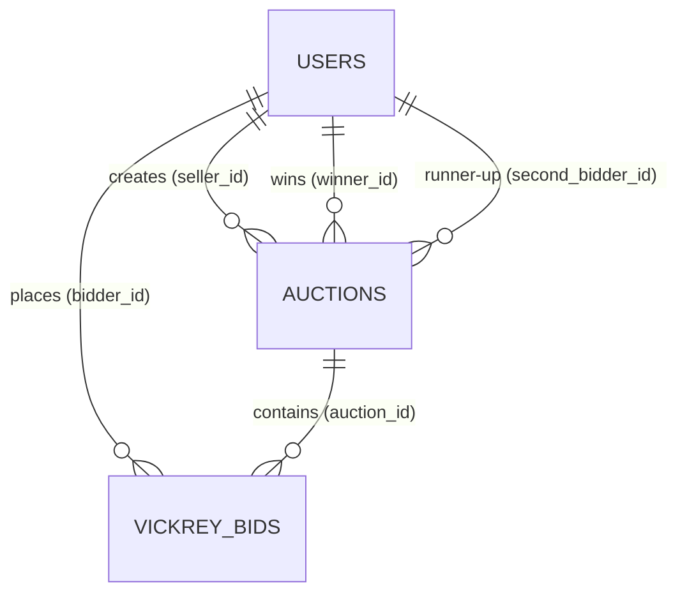

# Database Schema Specification (LLM Context)

- **Target Engine**: PostgreSQL 15+ (Production: PostgreSQL 18 Alpine)
- **Currency Standard**: All monetary values are `BIGINT` (Vietnamese Dong - VNĐ). No floating-point types (`DOUBLE`/`FLOAT`).

---

## 1. Tables Overview

---

## 2. Table: `users`
Authenticates and identifies sellers and bidders.

| Column | Type | Constraints | Description |
| :--- | :--- | :--- | :--- |
| `id` | `UUID` | `PRIMARY KEY` | Unique user ID (`UUID.randomUUID()`) |
| `username` | `VARCHAR(50)` | `NOT NULL, UNIQUE` | Unique handle |
| `password_hash`| `VARCHAR(100)` | `NOT NULL` | BCrypt password hash |
| `full_name` | `VARCHAR(100)` | `NOT NULL` | Display name |
| `created_at` | `TIMESTAMP WITH TIME ZONE` | `NOT NULL` | Creation timestamp |

---

## 3. Table: `auctions`
Stores shared attributes and engine-specific parameters using Single Table Inheritance (STI).

| Column | Type | Constraints | Description |
| :--- | :--- | :--- | :--- |
| `id` | `UUID` | `PRIMARY KEY` | Unique auction ID |
| `seller_id` | `UUID` | `NOT NULL, FK -> users(id)` | Seller reference |
| `title` | `VARCHAR(255)` | `NOT NULL` | Item title |
| `type` | `VARCHAR(20)` | `NOT NULL` | `'VICKREY'` or `'DUTCH'` |
| `status` | `VARCHAR(20)` | `NOT NULL` | `'COMMIT'`, `'REVEAL'`, `'ACTIVE'`, `'SOLD'`, `'SETTLED'`, `'CANCELLED'` |
| `start_price` | `BIGINT` | `NULL` | Ceiling start price (Dutch) |
| `floor_price` | `BIGINT` | `NULL` | Reserve floor price (Dutch) |
| `step_decrement` | `BIGINT` | `NULL` | Drop per interval (Dutch) |
| `step_interval_seconds` | `INT` | `NULL` | Interval duration in seconds (Dutch) |
| `reserve_price` | `BIGINT` | `NULL` | Minimum reserve price (Vickrey) |
| `start_time` | `TIMESTAMP WITH TIME ZONE` | `NOT NULL` | Start time |
| `commit_end_time` | `TIMESTAMP WITH TIME ZONE` | `NULL` | End of commit phase (Vickrey) |
| `reveal_end_time` | `TIMESTAMP WITH TIME ZONE` | `NULL` | End of reveal phase (Vickrey) |
| `end_time` | `TIMESTAMP WITH TIME ZONE` | `NOT NULL` | Overall auction closing time |
| `winner_id` | `UUID` | `NULL, FK -> users(id)` | Winner ID |
| `second_bidder_id`| `UUID` | `NULL, FK -> users(id)` | Second bidder ID (Vickrey audit) |
| `final_price` | `BIGINT` | `NULL` | Final transaction price in VNĐ |
| `version` | `BIGINT` | `NOT NULL, DEFAULT 0` | Optimistic locking counter |
| `created_at` | `TIMESTAMP WITH TIME ZONE` | `NOT NULL` | Record creation timestamp |

### Indexes:
- `idx_auctions_type_status` on `auctions(type, status)`

---

## 4. Table: `vickrey_bids`
Stores blind commitments and revealed actual bids for Vickrey auctions.

| Column | Type | Constraints | Description |
| :--- | :--- | :--- | :--- |
| `id` | `UUID` | `PRIMARY KEY` | Unique bid commitment ID |
| `auction_id` | `UUID` | `NOT NULL, FK -> auctions(id)` | Target auction (`ON DELETE CASCADE`) |
| `bidder_id` | `UUID` | `NOT NULL, FK -> users(id)` | Bidder reference |
| `blind_hash` | `VARCHAR(64)` | `NOT NULL` | SHA-256 hash in lowercase hex |
| `lockup_deposit` | `BIGINT` | `NOT NULL` | Visible deposit in VNĐ (>= actual bid) |
| `actual_bid` | `BIGINT` | `NULL` | Revealed actual bid in VNĐ |
| `is_revealed` | `BOOLEAN` | `NOT NULL, DEFAULT FALSE` | True if successfully revealed |
| `created_at` | `TIMESTAMP WITH TIME ZONE` | `NOT NULL` | Commit submission timestamp |
| `revealed_at` | `TIMESTAMP WITH TIME ZONE` | `NULL` | Reveal timestamp |

### Constraints & Indexes:
- **Unique Constraint**: `UNIQUE(auction_id, bidder_id)`
  - Guarantees at most 1 bid per user per auction.
  - Allows safe upserts (`INSERT ... ON CONFLICT (auction_id, bidder_id) DO UPDATE`).
- **Index**: `idx_vickrey_bids_settle` on `vickrey_bids(auction_id, is_revealed, actual_bid DESC)` for fast second-price resolution.
